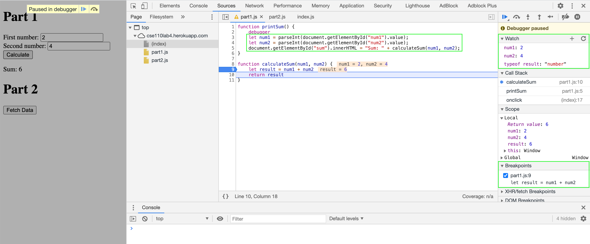
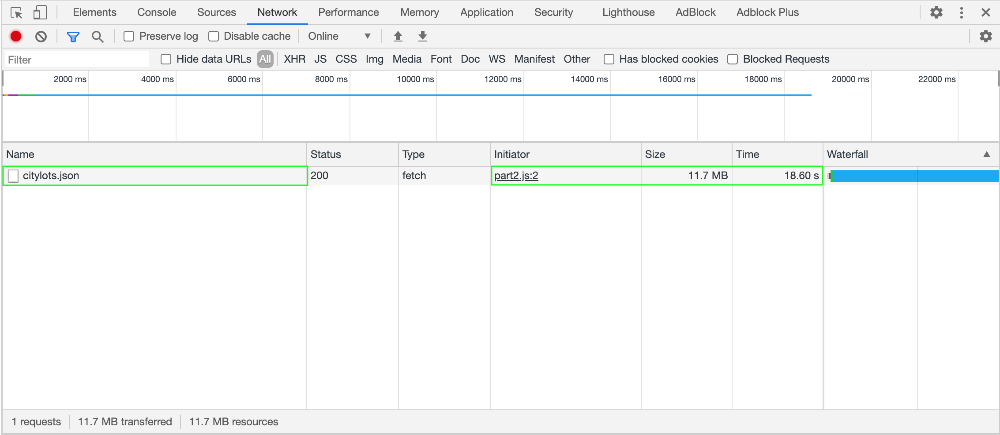
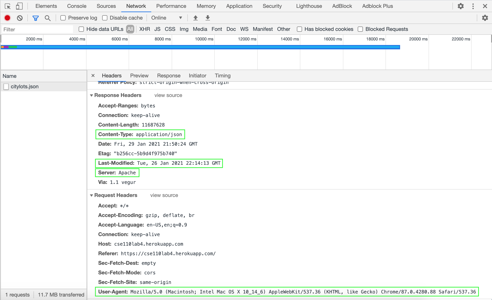
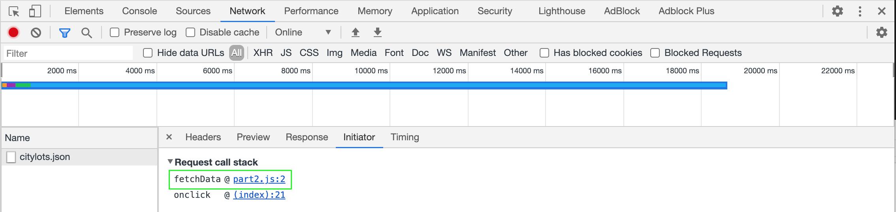

- `calculateSum()` takes two strings and concatenates them together.
- To fix this bug, convert the type of `num1` and `num2` from string to int using `parseInt()`.

1. citylots.json
2. part2.js
3. 11.7 MB
4. 18.60s\

5. Mozilla/5.0 (Macintosh; Intel Mac OS X 10_14_6) AppleWebKit/537.36 (KHTML, like Gecko) Chrome/87.0.4280.88 Safari/537.36
6. Apache
7. Tue, 26 Jan 2021 22:14:13 GMT
8. application/json\

9. onclick @ (index):21
